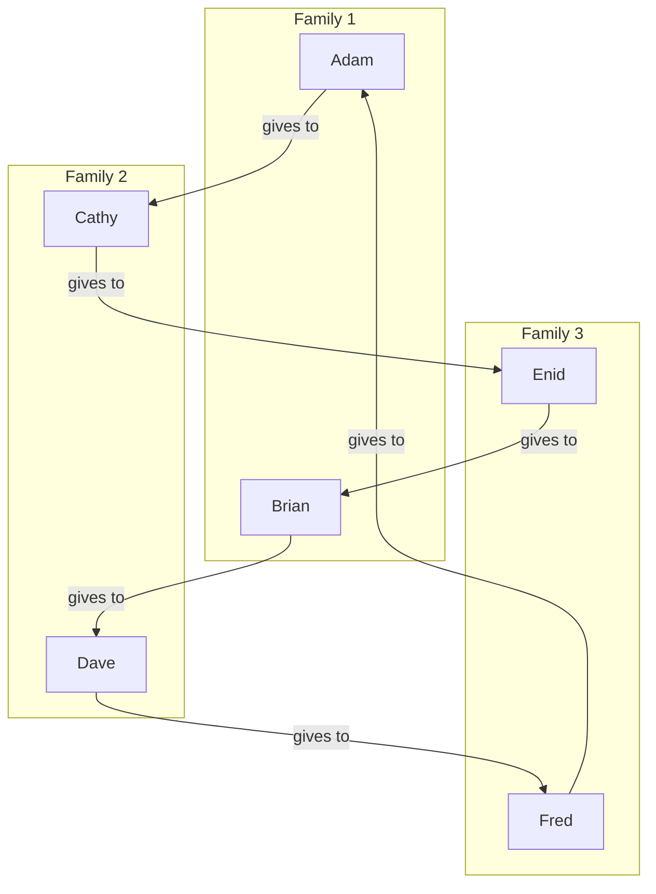
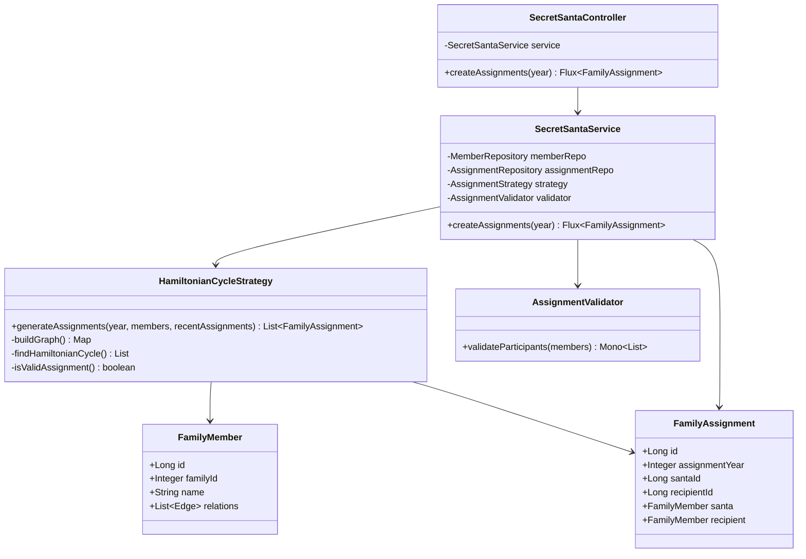

# Secret Santa Service

A Spring Boot 3 application that manages Secret Santa assignments with family-aware gift exchange logic.

## Algorithm Choice & Complexity

### Why Hamiltonian Cycle?
While simpler algorithms like Random Shift (O(n)) exist, they fail with uneven family sizes. Example:
```
Family1: A,B  Family2: C  Family3: D
```
Any fixed rotation pattern would inevitably connect family members (A->B or B->A). Hamiltonian Cycle can "jump" between participants to find valid paths (A->C->B->D->A).

### Algorithm Visualization



### Complexity
- **Best Case**: O(n²)
- **Worst Case**: O(n!)

## Quick Start

### Prerequisites
- JDK 17 or higher
- Docker and Docker Compose
- Maven 3.8+

### Running the Application
1. Start the database:
```bash
docker-compose up -d
```

2. Run the application:
```bash
./mvnw spring-boot:run
```

### Accessing Tools

#### Swagger UI
Access the API documentation at:
```
http://localhost:8080/swagger-ui.html
```

#### pgAdmin
Access the database management interface at:
```
http://localhost:5050

Login credentials:
Email: admin@admin.com
Password: root
```

To connect to the PostgreSQL database in pgAdmin:
1. Right click 'Servers' → 'Create' → 'Server'
2. Name: secret-santa
3. Connection tab:
    - Host: postgres
    - Port: 5432
    - Database: secret_santa
    - Username: postgres
    - Password: postgres

## Features & Rules

### Core Features
- Generates Secret Santa assignments while respecting family relationships
- Prevents immediate family members from being assigned to each other
- Maintains assignment history to avoid repeat assignments within 3 years
- Uses Hamiltonian Cycle algorithm for fair assignment distribution
- Reactive endpoints using Spring WebFlux
- R2DBC for reactive database operations

### Assignment Rules
1. A person cannot be their own Secret Santa
2. Family members cannot be assigned to each other
3. A person cannot be assigned the same recipient within a 3-year window
4. Each person must have exactly one gift giver and be a gift giver to exactly one person

## Assumptions & Constraints

### Family Relationships
1. Family members are identified by their `family_id`
2. Members with the same `family_id` are always considered immediate family
3. A member belongs to exactly one family (no split families or multiple family memberships)
4. Family relationships don't change during the year

### Assignment Rules
1. Each participant must be both a gift giver and receiver exactly once
2. The 3-year history rule is strict (no exceptions even if no other options are available)
3. Family size should be less than half of total participants for assignments to be possible
4. All participants from previous years continue to participate (no handling of members leaving)

### Technical Assumptions
1. Concurrent requests for the same year should generate different but valid assignments
2. Database is the single source of truth for all relationships and history
3. Assignment generation is idempotent for a given year (can be rerun if needed)
4. Performance scales factorially with number of participants due to the Hamiltonian Cycle algorithm (O(n!)).

### Data Assumptions
1. Member IDs are stable and don't change
2. Names are unique within a family but not necessarily across families
3. All database fields are required (no NULL values)
4. Family IDs are positive integers
5. Years are represented as integers (e.g., 2024)

## API Documentation

### Create Assignments
```http
POST /api/v1/secret-santa/assignments/{year}
```

Example Response:
```json
[
  {
    "santaId": 1,
    "recipientId": 3,
    "santa": {
      "name": "Adam",
      "familyId": 1
    },
    "recipient": {
      "name": "Cathy",
      "familyId": 2
    }
  }
]
```

## Technical Details

### Database Schema
```sql
CREATE TABLE IF NOT EXISTS members (
    id BIGSERIAL PRIMARY KEY,
    family_id INTEGER NOT NULL,
    name VARCHAR(255) NOT NULL
);

CREATE TABLE IF NOT EXISTS edges (
    edge_id BIGSERIAL PRIMARY KEY,
    type VARCHAR(50) NOT NULL,
    member_id BIGINT NOT NULL REFERENCES members(id)
);

CREATE TABLE IF NOT EXISTS assignments (
    id BIGSERIAL PRIMARY KEY,
    assignment_year INTEGER NOT NULL,
    giver_id BIGINT NOT NULL REFERENCES members(id),
    receiver_id BIGINT NOT NULL REFERENCES members(id)
);
```

### Technology Stack
- Java 17
- Spring Boot 3
- Spring WebFlux
- R2DBC with PostgreSQL
- JUnit 5
- Docker & Docker Compose

### Project Structure
```
src/
├── main/
│   ├── java/com/bettercloud/santa/
│   │   ├── controller/    # REST endpoints
│   │   ├── model/        # Domain entities
│   │   ├── repository/   # Data access
│   │   ├── service/      # Business logic
│   │   └── exception/    # Custom exceptions
│   └── resources/
│       ├── application.properties
│       └── schema.sql
└── test/
    └── java/com/bettercloud/santa/
        └── service/      # Unit tests
```

## Architecture

The service follows a layered architecture with reactive components:



Key Components:
- `SecretSantaController`: REST endpoint for assignment creation
- `SecretSantaService`: Core business logic and orchestration
- `HamiltonianCycleStrategy`: Assignment generation algorithm
- `AssignmentValidator`: Validates input data and constraints
- `FamilyMember` & `FamilyAssignment`: Domain models

### Design Patterns Used
- Strategy Pattern (Assignment generation)
- Repository Pattern (Data access)
- Service Layer Pattern (Business logic)
- DTO Pattern (API responses)

### Error Handling
- `InvalidParticipantsException` - Not enough participants
- `AssignmentImpossibleException` - Cannot generate valid assignments due to family constraints or history.
- `NoAssignmentsException` - No assignments exist for request

### Concurrency Support
- Reactive programming with WebFlux
- Non-blocking database operations with R2DBC
- Stateless design for horizontal scaling
- Thread-safe implementation

## Running Tests
```bash
./mvnw test
```

## Future Improvements
1. Add transaction management
2. Add different assignment algorithms like Random shift, Systematic swap, etc. Consider those strategies when the number of participants is large.
3. Add Graph DB for more complex relationships (could add related_member_id to members table)
4. Implement caching
5. Enhance validation rules
6. Expand test coverage
7. Add better logging and monitoring. API metrics that will be like clickstream data, how many times the API is called, how many times the API is successful, how many times the API is failed, etc.
8.  Optional extras functionalities
    1. Remembering gift item to a person from the previous time
    2. Option to exclude members if they cannot attend a particular year (Just as a bonus) - could have a boolean column in members table like `is_active` that can be toggled to 0 or 1 as needed defaulting to 1